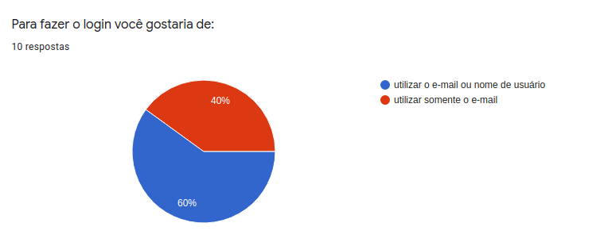
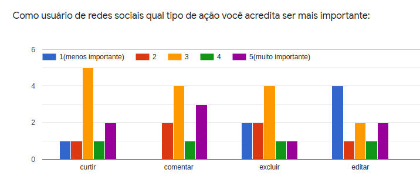
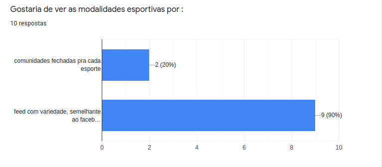
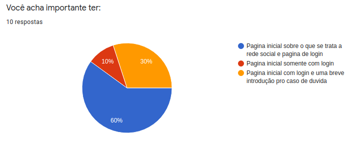
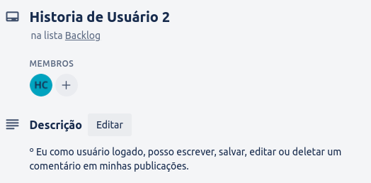

## Índice

- [1. Descrição](#1-descrição)
- [2. Conheça Olimpo](#2-conheça-olimpo)
- [3. Definições do produto](#3-definições-do-produto)
- [4. Implementações futuras](#4-implementações-futuras)
- [5. Tecnologias utilizadas](#5-tecnologias-utilizadas)
- [6. Considerações finais](#6-considerações-finais)
- [7. Desenvolvedoras](#7-desenvolvedoras)

---

## 1. Descrição

Projeto realizado durante o [**Bootcamp Laboratória - SAP005**]("http://laboratoria.la"), com intuito de criarmos uma rede social.

## 2. Conheça Olimpo

Olimpo é a rede social dos apaixonados por esportes e atividades físicas. Criada para unir pessoas que queiram compartilhar seus treinos diários, conquistas em equipe ou participar de conversas e debates sobre este universo.

*Para fazer parte do Olimpo acesse:* 

## 3. Definições do produto

Realizamos uma pesquisa com nossos usuários em potencial para definirmos o que seria mais relevante aparecer nas telas do Olimpo:

### Histórias de usuários

Para este projeto, trabalhamos com as seguintes histórias de usuário, de acordo com as necessidades apontadas em nossa pesquisa:

### Protótipos

Antes de colocar as mãos no código, e trazer o Olimpo a todos, desenhamos o que seria nossas telas principais:

_*Versão Mobile*_

_*Versão Desktop*_

## 4. Implementações futuras

- Permitir incluir imagens nas postagens;

- Permitir comentar nos posts;

- Criação da página de perfil dos nossos usuários;

- Envio de mensagens privadas;

- Implementar a parte de notificações;

- Alterar foto de perfil.

## 5. Tecnologias utilizadas

Para a realização deste projeto utilizamos:

- Firebase; :open_file_folder:

- Trello; :calendar:

- Visual Studio Code; :computer:

- PowerPoint; :card_index:  

- Moqups.:pencil:

## 6. Considerações finais

Gostaríamos de agradecer primeiramente a nossos familiares e amigos que se dispuseram a contribuir e auxiliar na fase de ideação e criação de Olimpo.
A toda equipe Laboratória pelo auxílio e empenho. A nossas colegas da SAP005 que caminharam conosco, compartilhando os conhecimentos e descobertas, e as queridas ex-alunas que foram luz em muitos momentos de dúvidas.

## 7. Desenvolvedoras 

Este projeto foi realizado por  <a href="https://github.com/giomadeira">Giovana Madeira</a>,
<a href="https://github.com/JulianaAmoriN">Juliana Silveira</a>, e 
<a href="https://github.com/Costahadassa">Hadassa Costa </a>. :rocket:

---